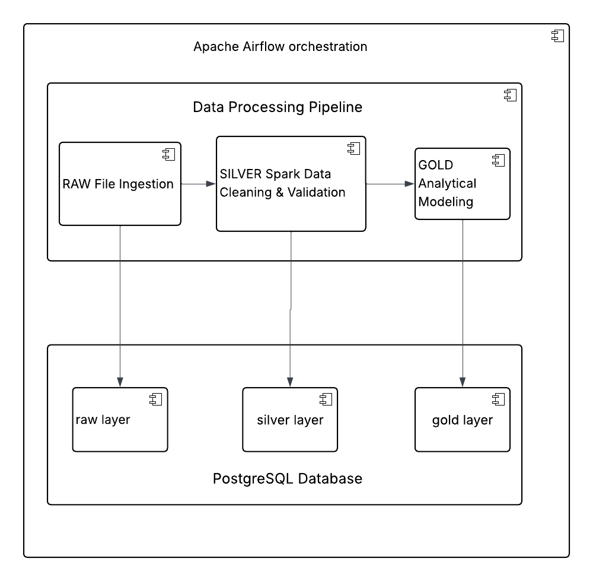
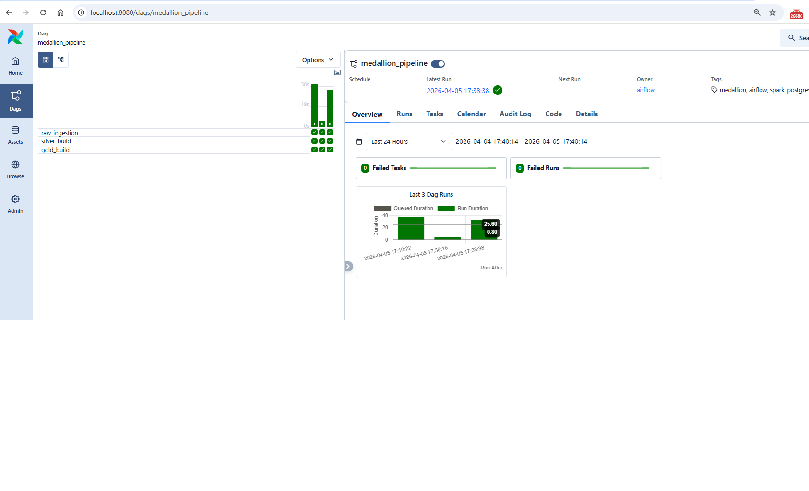

# BGD_zadanie2

## Cel zadania 
Celem projektu jest zaprojektowanie i implementacja skalowalnego pipeline’u przetwarzania danych transakcyjnych, który przekształca surowe, potencjalnie błędne dane w wysokiej jakości model analityczny (warstwa GOLD), umożliwiający wiarygodne raportowanie i analizę biznesową.

## Dane
Dane posidają następujące kolumny 

- transaction_id – unikalny identyfikator transakcji
- customer_id – unikalny identyfikator klienta
- customer_name – imię i nazwisko klienta
- merchant_id – unikalny identyfikator sprzedawcy
- transaction_ts – znacznik czasu wykonania transakcji
- amount – kwota transakcji
- city – miasto sprzedawcy
- country – kraj sprzedawcy
- payment_method – metoda płatności
- status – status transakcji

Do repozytorium GitHub dołączone zostały przykładowe pliki danych (katalog data).
Pipeline był również testowany na dużym pliku CSV o rozmiarze ~2,5 GB (https://drive.google.com/file/d/1uI-XWg8u_DqIr5-i24zRgWTYXB_m1Kfj/view?usp=sharing).

Problemy z danymi: 
- czasami null w kolumnie transaction_id
- błędna wartośc w kolumnie amount 
- błędna wartośc w kolumnie transaction_ts 
- duże i małe wyrazy określające ten sam status statuses = ["approved", "declined", "pending", "APPROVED"] 
- duże i małe wyrazy określające tą samą metodę płatności payment_methods = ["card", "blik", "transfer", "cash", "CARD"]

## Pipeline 

Pipeline medallion_pipeline jest zaimplemenotwany jako DAG w Airflow.

Pipeline ma trzy taski
###  RAW Ingestion – raw_ingestion()

Cel: przechowywanie surowych, historycznych danych (append-only)

- Wczytuje dane z pliku CSV w partiach (chunkach)
- Oblicza hash pliku i sprawdza, czy ten sam plik (nazwa + hash) został już wcześniej załadowany
- Ładuje tylko nowe pliki, dzięki czemu unika ponownego przetwarzania tych samych danych
- Nadaje każdej partii danych numer batcha (batch_no)
- Dodaje metadane: source_file, file_hash, loaded_at
- Zapisuje dane do tabeli: raw.transactions_raw
- Rejestruje załadowany plik w tabeli: raw.ingestion_log

Cechy:

- append-only (brak kasowania danych)
- pełna historia danych
- możliwość audytu i ponownego przetwarzania

### Cleaned and validated data – silver_build(should_continue: bool)

Cel: oczyszczone i zwalidowane dane

- Odczytuje dane z warstwy RAW przy użyciu Apache Spark i JDBC
- Przetwarza tylko nowe batch’e (na podstawie silver.batch_log)
- Czyści i normalizuje dane (tekst, daty, liczby)
- Wykonuje walidację danych (np. brak transaction_id, błędna data, błędna kwota, ujemna kwota)
- Dodaje kolumny: is_valid oraz validation_error
- Wykorzystuje Spark DataFrame API do skalowalnego przetwarzania danych
- Zapisuje dane do: silver.transactions_clean
- Używa mechanizmu UPSERT (ON CONFLICT DO UPDATE) na kluczu transaction_id
- Rejestruje przetworzony batch w tabeli: silver.batch_log

Cechy:

- przetwarzanie inkrementalne (tylko nowe batch’e)
- idempotentność (wielokrotne uruchomienie daje ten sam wynik)
- brak duplikatów na poziomie transaction_id
- skalowalne transformacje z użyciem Spark

### Analytical Modeling – gold_build(should_continue: bool)

Cel: dane gotowe do analizy i raportowania (schemat gwiazdy)

Buduje model analityczny:

- Tabele wymiarów:
    - gold.dim_customer
    - gold.dim_merchant
    - gold.dim_date
- Tabela faktów:
    - gold.fact_transactions
- Widok:
    - gold.v_transaction_report

Logika działania:

- Uwzględnia tylko poprawne dane (is_valid = true)
- Dla tabel wymiarów wybiera jeden rekord na klucz (np. customer_id)
- Stosuje deduplikację (np. DISTINCT ON), aby uniknąć wielu wersji tego samego rekordu
- Wszystkie tabele ładowane są przez UPSERT (ON CONFLICT DO UPDATE)
- Tabela faktów zawiera jeden rekord na transaction_id

Cechy:

- brak duplikatów w wymiarach
- możliwość aktualizacji danych (np. zmiana nazwy klienta)
- model typu star schema

## Parametr load_mode

Parametr load_mode określa sposób przetwarzania danych w pipeline i pozwala przełączać się pomiędzy trybem przyrostowym (incremental) oraz pełnym (full).

Jest on przekazywany w docker-compose lub podczas uruchamiania DAG-a w Apache Airflow

### Tryb incremental (domyślny)

Tryb przyrostowy przetwarza wyłącznie nowe dane, które nie były wcześniej załadowane.

W tym trybie:
- sprawdzane jest, czy plik został już wcześniej przetworzony (na podstawie file_hash i ingestion_log)
- jeśli plik już istnieje → pipeline pomija warstwę RAW
- w warstwie SILVER przetwarzane są tylko nowe batch’e danych
- w warstwie GOLD dane są aktualizowane przy użyciu operacji UPSERT

## Tryb full

Tryb pełny umożliwia ponowne przetworzenie wszystkich danych historycznych.

W tym trybie:
- dane są ładowane do RAW niezależnie od wcześniejszych zapisów (ignorowany jest ingestion_log)
- warstwa SILVER przetwarza wszystkie batch’e danych dostępne w RAW
- warstwa GOLD ponownie buduje model analityczny na podstawie pełnego zbioru danych

## Uruchomienie

docker compose -f pipeline_docker.yml build 

docker compose -f pipeline_docker.yml up 

## Sql tworzący bazę danych
postgres/init/02-init-medallion.sql

## Przydatne sql
SELECT count(1) FROM "raw".transactions_raw

SELECT count(1) FROM silver.transactions_clean

select * from gold.fact_transactions limit 1000

SELECT 
    schemaname,
    relname AS table_name,
    pg_total_relation_size(relid) / 1024 / 1024 / 1024 AS size_gb,
	pg_total_relation_size(relid) / 1024 / 1024 AS mb_gb
FROM pg_catalog.pg_statio_user_tables
ORDER BY size_gb DESC

## Możliwa konfiguracja z GUI airflow (file i load_mode)

Trigger DAG:
{
  "file": "/opt/airflow/data/transactions_03_24_1.csv",
  "load_mode": "incremental"
}

## Architektura

## Działający pipeline w airflow
